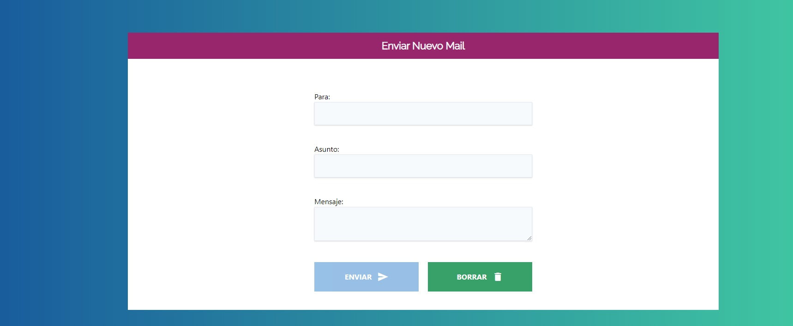

# Validar-Formulario-JS
Validar Formulario en JS

## Objetivo
+ Validar todos los campos del Formulario
+ Que cada campo tenga su tipo de datos
+ Validar el campo email mediante una expresion regular.
+ Activar el Boton una vez que los campos estan completados

### Visita el proyecto

[Visita el proyecto](https://miguelpl32.github.io/Validar-Formulario-JS/)

